# :syringe:Gscan
> Gscan is a high concurrency scanner based on golang

## :closed_book:Usage

:arrow_down:Download links: [Download](https://github.com/hack2fun/Gscan/releases)

Gscan use `--help` to show the usage
```sh
~ ./Gscan.exe
Gscan [--host address|--url url] [-p port] [-u username|-U filename] [-uf urlfile] [-p password|-P filename] [-m type] [-t thread] [-w num] [-o output_file] [-v]
Examples:
Gscan --host 127.0.0.1 -p 1-65535 -m portscan
Gscan --host 127.0.0.1 -m ssh -u root -P pass.txt
Gscan --url http://www.test.com -m urlscan --cookie "PHPSESSID=abc" --header '{"X-FORWARDED-FOR":"test
.com","Referer":"www.baidu.com"}'
Usage:
  -P string
        Select the path to the password dictionary
  -U string
        Select the path to the username dictionary
  -cookie string
        Set cookie
  -f string
        configuration file
  -h    Show help
  -header string
        Set http headers (format: JSON)
  -host string
        IP address of the host you want to scan,for example: 192.168.11.11 | 192.168.11.11-255 | 192.168.11.11,192.168.11.12
  -m string
        Select the type you want to scan.If you don't know the scan type and you can add -show to show all scan types
  -o string
        Save the results of the scan to a file
  -p string
        Specify a password
  -port string
        Select a port,for example: 22 | 1-65535 | 22,80,3306
  -show
        Show all scan type
  -t int
        Set number of threads (default 300)
  -u string
        Specify a username
  -uf string
        Select the path to the url path dictionary
  -url string
        url
  -v    Show details when scanning
  -w int
        Set timeout (default 2)
```

PS: `subdomain`,`urlscan`,`auth`module please use the parameter `--url` to specify the target instead of `--host`, `subdomain` and `urlscan` use `-uf` to specify the dictionary file but `auth` use `-P`.

## :pushpin:Test
Let's test the speed of each module
PS: My CPU host performance is not very good, so the speed may be slower
you can use `--show` to show  all scantype:`Gscan --show`
```
~ ./Gscan.exe --show
-m
   [mysql]
   [icmp]
   [memcached]
   [ftp]
   [smb]
   [subdomain]
   [redis]
   [auth]
   [portscan]
   [mssql]
   [ssh]
   [postgresql]
   [urlscan]
   [mongodb]
```
### ssh 
default port: `22`
Example:
```
Gscan --host target_ip -m ssh -u username -P password.txt -t 1000 -w 5
```

Profile example:
```ini
[CONFIG]
#Parameters are case sensitive, for example, only "Scantype", not "scantype"
Scantype = ssh
Host = 192.168.141.142
Port = 22 
Timeout = 5
Thread = 1000
Passfile = ./password.txt # or use "Password=" to specify a password
Username = username # or use "Userfile=" to specify a dictionary file
#Output = output_file #Output results to a file
#ErrShow = false #Whether to display error messages during scanning
```
Test:

|module | length |threads | timeout | time consuming|
|:-:|:-:|:-:|:-:|:-:|
|ssh |1053| 200 | 2s (default) | 2.9s|

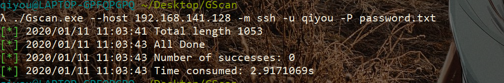

### postgresql

default port: `5432`

Example:
```
Gscan --host target_ip -m postgresql -u username -P password.txt -t 1000 -w 5
```

Profile example: Reference ssh

Test:

|module | length |threads | timeout | time consuming|
|:-:|:-:|:-:|:-:|:-:|
|postgresql |1053| 1000 | 2s (default) | 4.0s|

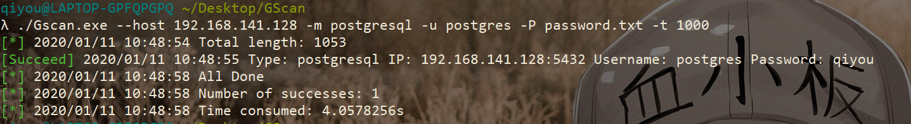

### Mongodb

default port: `27017`

Example:
```
Gscan --host target_ip -m mongodb -u username -P password.txt -t 1000 -w 5
```

Profile example: Reference ssh

Test:

|module | length |threads | timeout | time consuming|
|:-:|:-:|:-:|:-:|:-:|
|mongodb | 1054 | 1000 | 2s (default) | 2.7s|

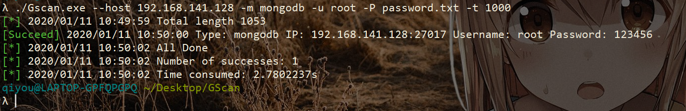

### Memcached

default port: `11211`

Example:
```
Gscan --host target_ip -m memcached -t 1000 -w 5
```

Profile example: Reference ssh

Test:

|module | length |threads | timeout | time consuming|
|:-:|:-:|:-:|:-:|:-:|
|memcached | 256  | 300 (default) | 2s (default) | 2.6s|

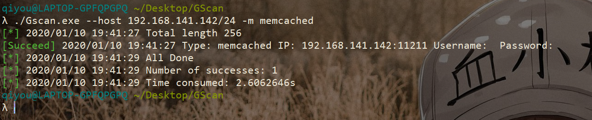

### MySQL

default port: `3306`

Command line example:
```
Gscan --host target_ip -m mysql -u username -P dict.txt -t 1000 -w 5
```

Profile example: Reference ssh

Test:

|module | length |threads | timeout | time consuming|
|:-:|:-:|:-:|:-:|:-:|
|mysql | 1054  | 300 (default) | 2s (default) | 3.0s|

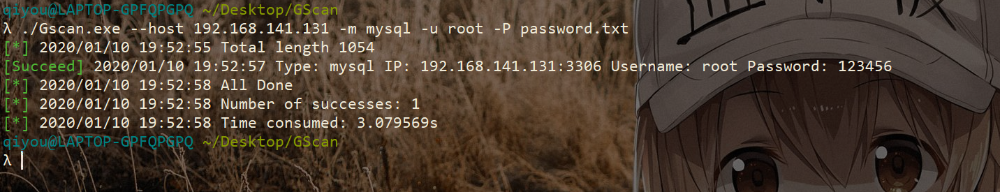

### smb

default port: `445`

Command line example:
```
Gscan --host target_ip -m smb -u username -P dict.txt -t 1000 -w 5
```
Profile example: Reference ssh

Test:

|module | length |threads | timeout | time consuming|
|:-:|:-:|:-:|:-:|:-:|
|smb | 1053  | 1000 | 1s | 2.0s|

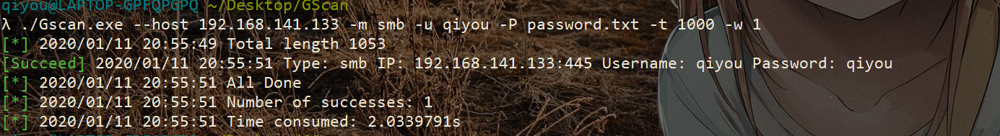

### ftp
default port: `21`

Command line example:
```
Gscan --host target_ip -m ftp -u username -P dict.txt -t 1000 -w 5
```
Profile example: Reference ssh

Test:

|module | length |threads | timeout | time consuming|
|:-:|:-:|:-:|:-:|:-:|
|ftp | 1054  | 300 (default) | 2s (default) | 2.1s|

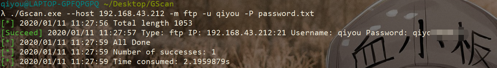

### Redis
default port: `6379`

Command line example:
```
Gscan --host target_ip -m redis -P dict.txt -t 1000 -w 5
```
Profile example: Reference ssh

Test:

|module | length |threads | timeout | time consuming|
|:-:|:-:|:-:|:-:|:-:|
|redis | 1054  | 300 (default) | 2s (default) | 471.7ms|

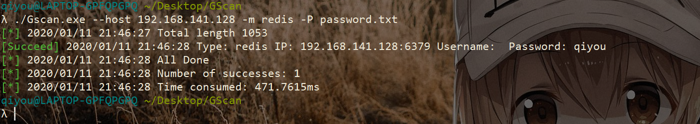

### MSSQL
default port: `1433`

Command line example:
```
Gscan --host target_ip -m mssql -u sa -P dict.txt -t 1000 -w 5
```
Profile example: Reference ssh

Test:

|module | length |threads | timeout | time consuming|
|:-:|:-:|:-:|:-:|:-:|
|mssql | 1054  | 300 (default) | 2s (default) | 10.1s|

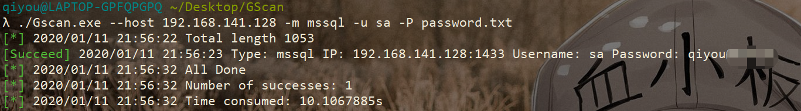

### Portscan
> Scan target host open ports

Example:
```
Gscan --host target_ip -m portscan -port 22,3306 -t 1000 -w 5
Gscan --host target_ip -m portscan -port 1-65535 -t 1000 -w 5
```

Profile example:
> Gscan -f config.ini

```ini
[CONFIG]
#Parameters are case sensitive, for example, only "Scantype", not "scantype"
Scantype = portscan
Host = 127.0.0.1
Ports = 1-1000
Timeout = 5
Thread = 1000
#Output = output_file #Output results to a file
#ErrShow = false #Whether to display error messages during scanning   
```

Test:

|module | length |threads | timeout | time consuming
|:-:|:-:|:-:|:-:|:-:|
|portscan | 1000  | 300 (default) | 2s (default) | 8.6s|

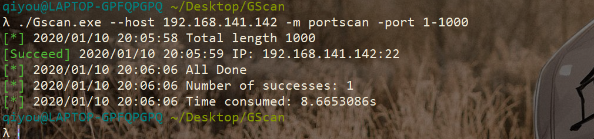

### icmp
> Ping to determine whether the target host is alive

Example:
```
Gscan --host 192.168.1.1/24 -m icmp -t 1000 -w 5
Gscan --host 192.168.1.1-125 -m icmp -t 1000 -w 5
Gscan --host 192.168.1.1,192.168.1.11 -m icmp -t 1000 -w 5
```
Prefix example:
```ini
[CONFIG]
#Parameters are case sensitive, for example, only "Scantype", not "scantype"
Scantype = icmp
Host = 192.168.43.212/24
Timeout = 5
Thread = 1000
#Output = output_file #Output results to a file
#ErrShow = false #Whether to display error messages during scanning   
```

Test:

|module | length |threads | timeout | time consuming|
|:-:|:-:|:-:|:-:|:-:|
|icmp | 256  | 300 (default) | 2s (default) | 6.1s|


### urlscan
> url path scan

default dictionary: `./dict/dicc.txt` (this dictionary from `dirsearch`)

Example:
```
Gscan --url http://url -m urlscan -t 1000 -w 5 (default use ./dict/dictt.txt)
Gscan --url http://url -m urlscan -uf dict.txt -t 1000 -w 5
Gscan --url http://baidu.com -m urlscan --cookie "PHPSESSID=abc"
Gscan --url http://baidu.com -m urlscan --cookie "PHPSESSID=abc" --header '{"X-FORWARDED-FOR":"test
.com","Referer":"www.baidu.com"}'
```

Prefix example:
```ini
[CONFIG]
#Parameters are case sensitive, for example, only "Scantype", not "scantype"
Scantype = urlscan
Url = http://192.168.141.128:7777
UrlFile = ./dict.txt
Timeout = 5
Thread = 1000
#Cookie = your_cookie #set cookie
#Header = your_header #set header
#Output = output_file #Output results to a file
#ErrShow = false #Whether to display error messages during scanning   
```

Test:

|module | length |threads | timeout | time consuming|
|:-:|:-:|:-:|:-:|:-:|
|urlscan | 1054 | 300 (default) | 2s (default) | 9.0s|

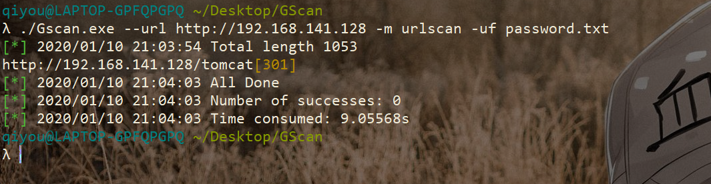

### apacheAuth
> Apache basic authentication

Example:
```
Gscan --url http://url -m auth -u qiyou -P dict.txt -t 1000 -w 5
Gscan --url http://url -m auth -u qiyou -P dict.txt -t 1000 -w 5 --cookie "PHPSESSID=abc" --header '{"X-FORWARDED-FOR":"test.com","Referer":"www.baidu.com"}'
```
Prefix example
```ini
[CONFIG]
#Parameters are case sensitive, for example, only "Scantype", not "scantype"
Scantype = auth
Url = http://192.168.141.128:7777
Passfile = ./password.txt
Username = admin
Timeout = 5
Thread = 1000
#Cookie = your_cookie #set cookie
#Header = your_header #set header
#Output = output_file #Output results to a file
#ErrShow = false #Whether to display error messages during scanning   
```

Test:

|module | length |threads | timeout | time consuming|
|:-:|:-:|:-:|:-:|:-:|
|auth | 1053 | 300 (default) | 2s (default) | 7.5s|

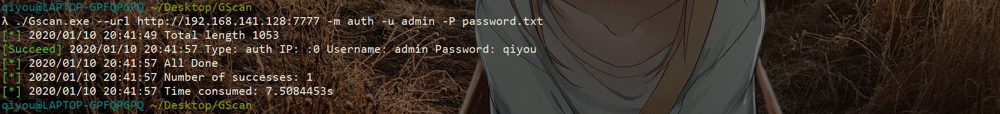

### subdomain
> Subdomain violence enumeration

default dictionary: `./dict/sub.txt` (this dictionary from lijiejie's `subDomainsBrute`)

Please do not bring `http://` or `https://`, for example: `www.baidu.com`, `baidu.com`
Example:
```
Gscan --url baidu.com -m subdomain -uf password.txt -t 1000 -w 5
Gscan --url baidu.com -m subdomain 1000 -w 5 (default use ./dict/sub.txt)
```

Prefix example:
```ini
[CONFIG]
#Parameters are case sensitive, for example, only "Scantype", not "scantype"
Scantype = subdomain
Url = baidu.com
UrlFile = ./dict.txt
Timeout = 5
Thread = 1000
#Output = output_file #Output results to a file
#ErrShow = false #Whether to display error messages during scanning   
```

Test:

|module | length |threads | timeout | time consuming|
|:-:|:-:|:-:|:-:|:-:|
|subdomain | 1053 | 300 (default) | 2s (default) | 4.8s|

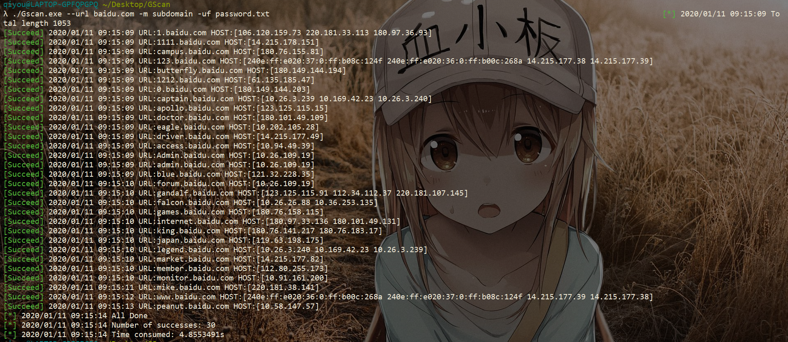

## :speech_balloon:End
PS: If a false positive occurs during the test, you can increase the timeout or lower the thread,it depends on the target host

If you have any good suggestions or find any bugs, welcome to issue,thanks
